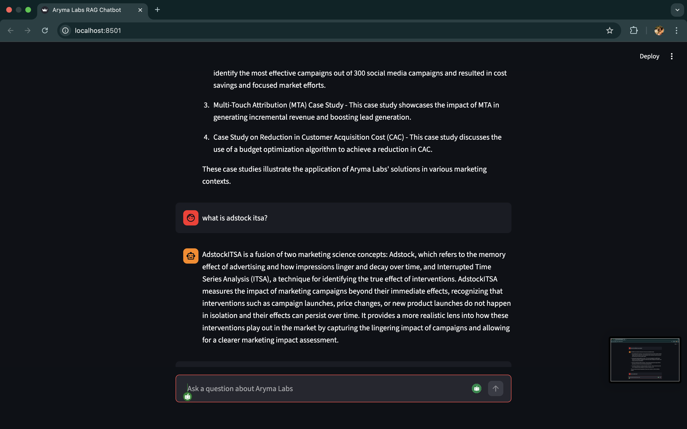
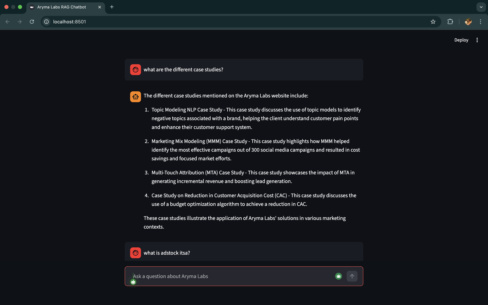

# Aryma Labs RAG Chatbot

## Overview

This project implements a Retrieval Augmented Generation (RAG) chatbot that answers user questions using content from the official Aryma Labs website (https://www.arymalabs.com).
The system crawls and indexes website content, detects changes over time, and uses a RAG pipeline to generate grounded answers. It also maintains short term conversational memory within a user session and provides a Streamlit chat interface for interaction.


## Architecture Overview

### Data ingestion and indexing
- Crawls pages from arymalabs.com
- Extracts and cleans text content
- Chunk the content into pieces
- Generates embeddings
- Stores vectors in a FAISS index
- Tracks page content changes using hashing

### RAG pipeline
- Uses a retriever to fetch relevant chunks from FAISS
- Uses an LLM to answer queries using retrieved context
- Implements LangGraph for state management
- Maintains conversation context in the state object

### UI
- Built using Streamlit
- Chat style interface
- Displays assistant responses and source links
- Maintains session memory using Streamlit session state

## Set up and run instructions

### 1. Clone the repository

```
git clone https://github.com/angel-peter-pv/aryma-rag-chatbot
cd aryma-rag-chatbot
```

### 2. Create Virtual Environment

```
python -m venv .venv
source .venv/bin/activate
```

### 3. Install Dependencies

```
pip install -r requirements.txt
```

### 4. Set Environment Variables

Create .env file

```
OPENAI_API_KEY=your_openai_api_key
```

### 5. Run Ingestion Pipeline

```
python ingestion/run_ingestion.py
```
This step crawls the website, detects new or updated pages, and updates the embeddings and FAISS index accordingly.

### 6. Run the Chatbot UI

```
streamlit run streamlit_app.py
```


## Change detection strategy

To ensure the chatbot reflects website updates automatically:
- Each crawled page content is hashed
- Hashes are stored in a metadata file
- On subsequent crawls:
    - New pages are detected
    - Updated pages are re embedded
    - Unchanged pages are skipped
  
This avoids unnecessary reprocessing while ensuring the vector index remains up to date.


## Short Term Memory Implementation Details

Short term conversational memory is implemented using:
- LangGraph state for RAG context
- Streamlit session_state for session persistence

For each interaction, the system tracks the latest user query, retrieved documents, generated answer, source references, and a sliding window of recent chat messages. Only the most recent 10 messages are passed to the LLM to handle follow up questions and conversational references, which prevents unnecessary context growth and avoids exceeding the model's context window. Memory is scoped to a single browser session and resets automatically when the session ends.


## Design Decisions

To reduce hallucinations, the model is instructed to answer only using the retrieved website content. Clear system and user prompts are used to prevent the model from making assumptions. If the required information is not present in the content, the assistant responds with "I don't know based on the website." The model temperature is set to 0 to ensure consistent, factual, and non creative responses. 

Retrieved website content and conversational history are stored separately in the state. Only the retrieved website content is treated as the source of truth for answering questions, while conversation history is used only to understand follow up references. This separation helps prevent the model from treating past conversation as factual knowledge and reduces the risk of hallucinations.

Streaming responses were explored during design, but they were not implemented in the current version. The average response latency was around 4 seconds, which was acceptable for this scope, and adding streaming would have increased implementation complexity without a clear benefit. If response latency increases in the future, streaming responses can be added as an improvement.


## Limitations and possible improvements
- The ingestion and change detection pipeline is triggered manually now, scheduling could automate periodic crawling and updates.
- The chatbot maintains only short term memory within a single user session. Long term memory across sessions can be added to improve conversations.
- The knowledge base is limited to the Aryma Labs website, expanding to other sources or enabling user document uploads would increase its usefulness.
- Adding language translation support would allow the chatbot to answer queries in multiple languages.
- In the future, support can be added for image uploads, where users can upload an image and ask the chatbot to explain or describe it.
- A caching layer can be introduced in the future to reuse recent retrieval or LLM responses and further reduce latency.


## Demonstration 

*demo screenshot 1*



*demo screenshot 2*


### Demonstration video of the chatbot
[click to watch demo](https://youtu.be/yi-bf9DPaVI)


